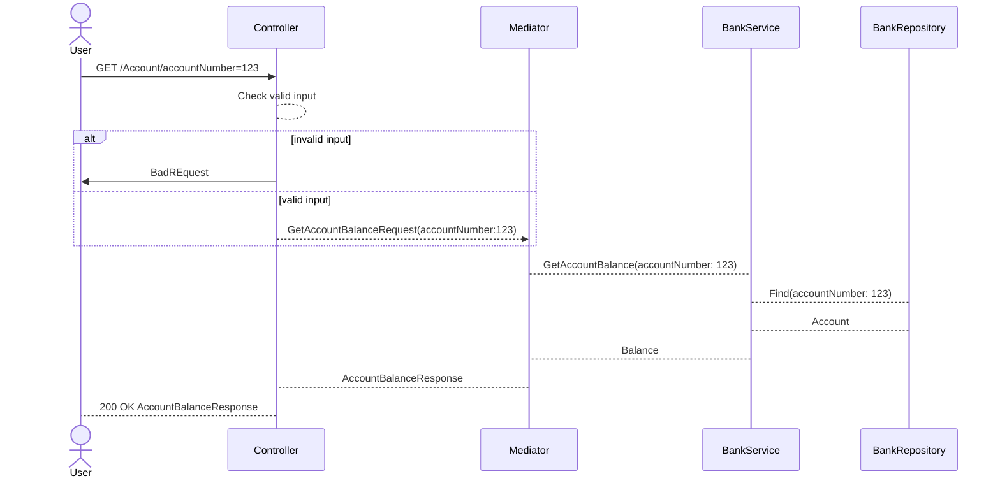

This is a simple project to help introduce a team to functional programming concepts.
The system under study is a rudimentary bank api with 3 ednpoints:
- /Account : Get the balance for an account
- /Account/credit: Credit an account
- /Account/debit: Debit an acount

This is in no way even near what a real implementation should look like. 

It's only meant as an easy to understand system, which shows the usual patterns for executing queries or commands in a regular business line application with several components:

-  Controllers
-  mediator handlers 
-  services  
-  repositories

It is also meant to highlight common OOP implementation patterns, that are usually problematic from the Functional Programming perspective. Things like:

- throwing exceptions for expected behavior
- not checking for nulls either by mistake within the own codebase or by using external libraries
- void methods, that usually implement side-effects
- not catching exceptions thrown, and letting the api deal with it by returning status 500 responses

The sequence diagram for e.g. the "Get  Balance" operation looks like:

